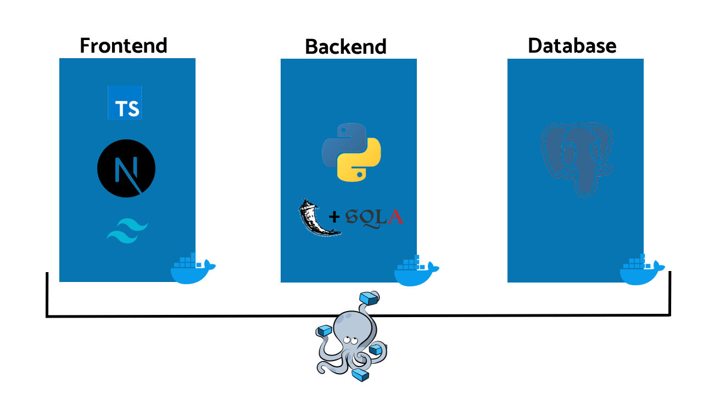
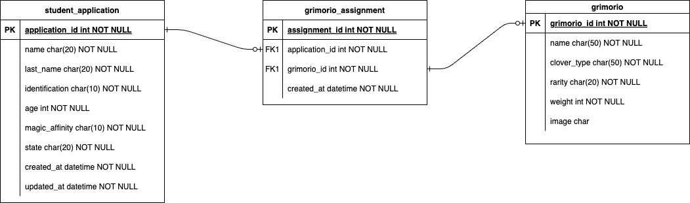

# Magic Academy

## Caso Práctico

En el Reino del Trébol, el Rey Mago necesita un sistema para la academia de magia que administre el registro de solicitud de estudiantes y la asignación aleatoria de sus Grimorios.
Los Grimorios se clasifican según el tipo de trébol en la portada, y los estudiantes según sus afinidades mágicas específicas.

## Endpoints Requeridos

- **POST /solicitud:** Envía solicitud de ingreso.
- **PUT /solicitud/{id}:** Actualiza solicitud de ingreso.
- **PATCH /solicitud/{id}/estatus:** Actualiza estatus de solicitud.
- **GET /solicitudes:** Consulta todas las solicitudes.
- **GET /asignaciones:** Consulta asignaciones de Grimorios.
- **DELETE /solicitud/{id}:** Elimina solicitud de ingreso.

## Datos Requeridos en la Solicitud

- **Nombre:** solo letras, máximo 20 caracteres.
- **Apellido:** solo letras, máximo 20 caracteres.
- **Identificación:** números y letras, máximo 10 caracteres.
- **Edad:** solo números, 2 dígitos.
- **Afinidad Mágica:** Una única opción entre Oscuridad, Luz, Fuego, Agua, Viento o Tierra.

## Notas Importantes

Las solicitudes que no cumplan con los criterios establecidos deben ser automáticamente rechazadas y no se les debe asignar un Grimorio. La asignación de Grimorios debe ser aleatoria cuando se apruebe la solicitud.

Opcionalmente sumas puntos si consideras un sistema de asignación con una ponderación que hable de la rareza de la portada asignada, por ejemplo, un trébol de una o dos hojas es común, uno de tres es poco habitual, uno de cuatro es inusual, y uno de cinco hojas muy raro.

## Arquitectura del proyecto

Utiliza una base de datos relacional [PostgreSQL](https://www.postgresql.org) para el almacenamiento de los datos de las solicitudes, asignaciones y el catálogo de Grimorios disponibles. PostgreSQL es una opción robusta y confiable para gestionar datos relacionales.

Para el desarrollo del backend, se utilizará el framework [Flask](https://flask.palletsprojects.com/en/3.0.x) en conjunto con [SQLAlchemy](https://www.sqlalchemy.org), conocido por su simplicidad y flexibilidad en la construcción de aplicaciones web en Python. Flask permite crear APIs RESTful de manera rápida y eficiente, mientras que SQLAlchemy proporciona una capa de abstracción para interactuar con la base de datos PostgreSQL de forma intuitiva.

El frontend se desarrolló utilizando [Next.js](https://nextjs.org), un framework de React que facilita la creación de aplicaciones web modernas y rápidas. Next.js ofrece características como renderizado del lado del servidor (SSR) y generación de sitios estáticos (SSG), lo que mejora el rendimiento y la experiencia del usuario.

Para facilitar el despliegue y la gestión del entorno de desarrollo, se utilizó Docker y Docker Compose. Docker permite encapsular la aplicación y sus dependencias en contenedores, garantizando la portabilidad y consistencia del entorno de ejecución. Docker Compose, por otro lado, simplifica la orquestación de múltiples contenedores y permite definir y configurar fácilmente la infraestructura necesaria para el desarrollo y despliegue de la aplicación.

A continuación, se muestra un ejemplo visual de cómo se estructuran y comunican los componentes mencionados:

Esta arquitectura proporciona una base sólida para el desarrollo de la aplicación, asegurando un almacenamiento confiable de los datos, una comunicación eficiente entre el backend y el frontend, y una gestión sencilla del entorno de desarrollo.

## Arquitectura de la base de datos

La arquitectura de la base de datos consta de tres tablas principales para almacenar la información relacionada con las solicitudes de los estudiantes, las asignaciones de los Grimorios y el catálogo de Grimorios disponibles. Estas tablas son:

1. **student_application:** Esta tabla almacenará la información de las solicitudes de los estudiantes. Aquí se guardarán los datos relevantes como el nombre del estudiante, la fecha de la solicitud, el estado de la solicitud, entre otros.

2. **grimorio_assignment:** En esta tabla se guardará la información de las asignaciones de los Grimorios. Aquí se registrarán los detalles de cada asignación, como el ID de la solicitud, el ID del Grimorio asignado, la fecha de creación, etc.

3. **grimorio:** Esta tabla almacenará la información del catálogo de Grimorios disponibles para las asignaciones. Aquí se guardarán los datos de cada Grimorio, como su nombre, rareza, peso, etc.

A continuación, se muestra un diagrama entidad-relación que representa la relación entre estas tablas:

Este diagrama visualiza la estructura y las relaciones entre las tablas, lo que facilita la comprensión de cómo se almacena y se relaciona la información en la base de datos.

## Autor

[@pachedev](https://www.github.com/pachedev)

## Licencia

[MIT](https://choosealicense.com/licenses/mit)
